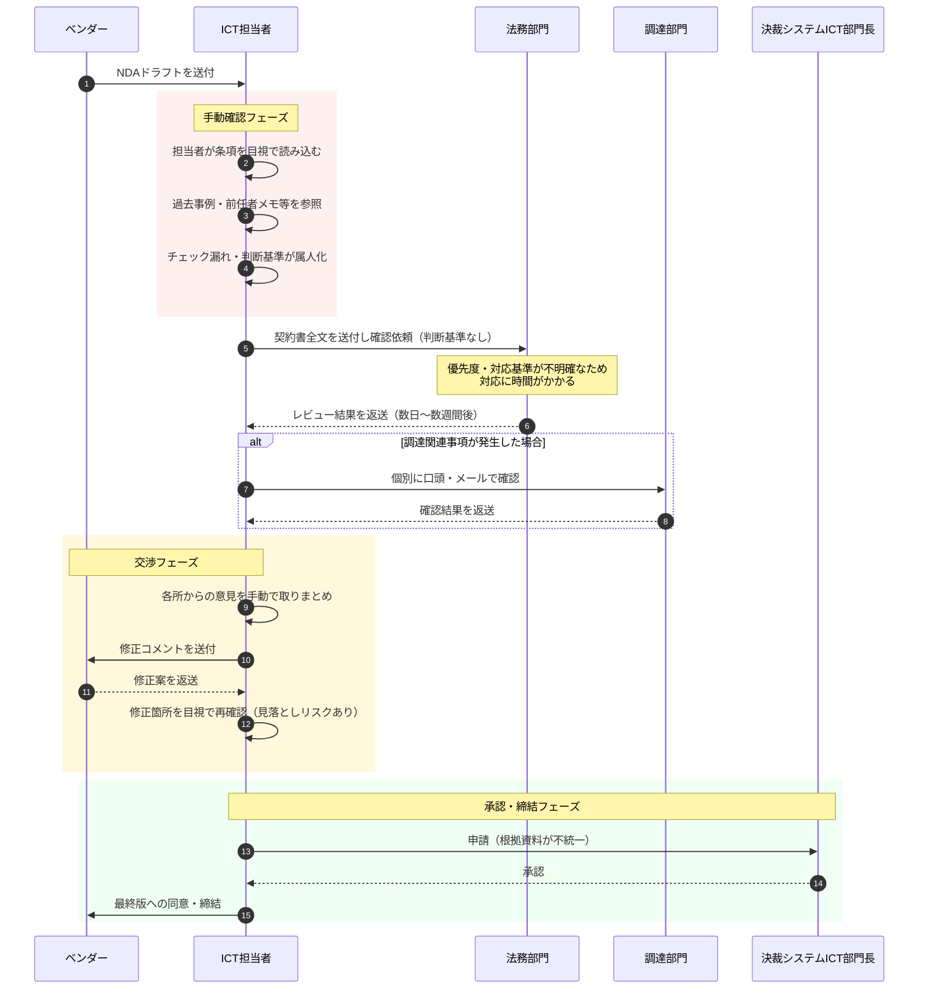
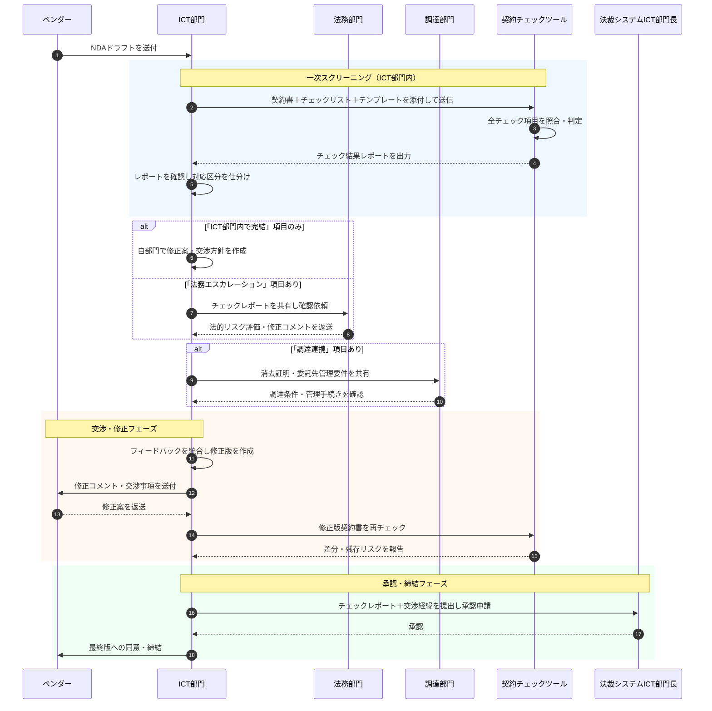

# 業務改善アイデア（契約書の自動チェック機能の検討）

## 契約書チェッカーの概要

- 契約書チェッカーは、AIを活用してIT契約書のレビューを支援するツールです。
- 担当者が契約書テキスト・チェックリスト・出力テンプレートの3点を添付して送信するだけで、全チェック項目について「条文あり／なし」と「充足度（1〜5段階）」を自動判定し、根拠となる条文番号・文言抜粋を付けたチェック結果レポートを出力します。

- チェック項目には「ICT部門内で完結」「法務エスカレーション」「調達連携」の対応区分が設定されており、担当者は出力レポートをもとに各部門への振り分けを迷わず行えます。- これにより、専門知識に依存していた契約審査の属人化を解消し、部門横断での標準化されたレビュープロセスを実現します。

- なお、PoCフェーズではNDA契約に特化したプロンプトを用いて検証を行いますが、将来的にはITに関する他の契約類型にも対応する予定です
- また契約書の名称に関わらず、複数の特徴を持った契約書にも対応する事を想定しています

 

## 契約書チェッカーのユースケース

**日常的な契約審査の一次スクリーニング**

- 法務部門に回す前の段階で、ICT担当者が自分でNDAのチェックを完結させるのが最も基本的な使い方です。
- 「この条項は法務に確認が必要か、部門内で完結できるか」を判断する基準がチェックリストに内包されているため、無駄なエスカレーションを減らせます。

**ベンダー・パートナーとの契約交渉の準備**

- 相手方から提示されたドラフトを受け取った際に、自社にとって不利な条項や欠落している保護条項を素早く特定し、交渉ポイントを整理する目的で使えます。
- 交渉前の論点出しとして有効です。

**社内テンプレートの品質管理**

- ひな形や標準テンプレートを定期的にチェックして、最新の法的要件や社内ポリシーに照らして陳腐化していないかを確認する用途に使えます。

**教育・ナレッジ共有**

- 新入社員や、契約書を初めて扱う社員に対して「契約書のどこを見るべきか」を学ぶ教材として使えます。
- チェックレポートを見ながら契約書を読む経験を積むことで、属人化しがちなリーガルリテラシーを組織全体に広げられます。

**調達・購買プロセスへの組み込み**

- SaaS導入やクラウドサービス契約の際に、ベンダーと締結する契約や利用規約のチェックを標準化するフローに組み込めます。
- 担当者が変わっても同じ品質のスクリーニングが行われるようになります。

 

## 業務プロセス（Before／After）

### Before

 

### 現プロセスの問題点

**業務効率性の観点**

| # | 問題点 | 該当フェーズ |
|---|--------|------------|
| 1 | 担当者が契約書を全文目視確認するため、1件あたりの確認工数が大きく、件数が増えると対応がひっ迫する | 手動確認フェーズ |
| 2 | エスカレーション基準がなく法務部門へ全件送付するため、法務側の負荷が高まり、レビュー完了まで数日〜数週間の待ち時間が発生する | 法務確認フェーズ |
| 3 | 調達部門との連携が場当たり的な口頭・メール確認にとどまり、確認漏れや重複確認が生じやすい | 調達確認フェーズ |
| 4 | 各部門から返ってきた意見を担当者が手動で取りまとめるため、統合作業の工数が大きく、情報の欠落も起きやすい | 交渉フェーズ |
| 5 | 修正版の差分確認も目視で行うため、ラウンドを重ねるほど確認コストが累積する | 交渉フェーズ |

---

 

**業務品質の観点**

| # | 問題点 | 該当フェーズ |
|---|--------|------------|
| 1 | チェック項目・判断基準が担当者個人の知識・経験に依存しており、担当者が変わると確認の深度や視点がばらつく（属人化） | 手動確認フェーズ |
| 2 | 過去事例やメモが体系化されていないため、同種の契約であっても確認水準が一定に保たれない | 手動確認フェーズ |
| 3 | エスカレーション判断に基準がないため、本来法務に相談すべき項目が見過ごされたり、逆に不要な相談が多発したりする | 法務確認フェーズ |
| 4 | 修正版の目視再確認では変更箇所の見落としリスクがあり、意図せず不利な条項が残存したまま締結に至る可能性がある | 交渉フェーズ |
| 5 | 承認申請時の根拠資料が担当者ごとに異なり、承認の判断基準が標準化されていないため、決裁の質が担当者次第になる | 承認・締結フェーズ |

 

### After

 

### Afterプロセスの補足説明

プロセスは大きく3つのフェーズに分かれます。

**① 一次スクリーニング（IT部門内で完結）**
- ベンダーから契約書ドラフトを受け取ったら即座にチェッカーへ投入します。
- 出力されたレポートの「対応区分」列を見て、エスカレーション先を仕分けるのがポイントです。

**② 並行レビューフェーズ**
- 「法務エスカレーション」項目があれば法務部門へ、「調達連携」項目（消去証明・委託先管理など）があれば調達部門へ、それぞれチェックレポートごと共有します。
- ICT担当者が全体の交通整理役になります。修正版が届いたら再度チェッカーに通すことで差分リスクを確認できます。

**③ 承認・締結フェーズ**
- チェックレポートと交渉経緯をセットで部門長へ提出することで、承認の根拠が可視化・標準化されます。

 

### プロセス変更による改善期待

**業務効率性の観点**

| # | 改善点 | 該当フェーズ |
|---|--------|------------|
| 1 | AIが全チェック項目を自動判定するため、担当者による全文目視確認が不要となり、1件あたりの初期確認工数を大幅に削減できる | 一次スクリーニングフェーズ |
| 2 | 対応区分により必要な項目のみを法務部門へエスカレーションするため、法務側の負荷が軽減され、レビュー完了までのリードタイムが短縮される | 法務確認フェーズ |
| 3 | 「調達連携」区分の項目がレポート上で明示されるため、調達部門への連携事項が整理され、確認漏れや重複確認が解消される | 調達確認フェーズ |
| 4 | チェックレポートが統一フォーマットで出力されるため、各部門の意見集約の起点として活用でき、取りまとめ工数が削減される | 交渉・修正フェーズ |
| 5 | 修正版を再投入するとAIが差分・残存リスクを報告するため、ラウンドを重ねても確認コストが増加しにくい | 交渉・修正フェーズ |

---

 

**業務品質の観点**

| # | 改善点 | 該当フェーズ |
|---|--------|------------|
| 1 | 標準化されたチェックリストに基づくAI判定を起点とするため、担当者が変わっても一定水準の確認品質が保たれ、属人化が解消される | 一次スクリーニングフェーズ |
| 2 | 全チェック項目を網羅的に判定し、条文番号・文言根拠を付けてレポート出力するため、確認の深度が担当者の経験に依存しなくなる | 一次スクリーニングフェーズ |
| 3 | 対応区分（ICT部門内完結／法務エスカレーション／調達連携）がレポートに明示されるため、エスカレーション判断の基準が統一され、相談漏れ・過剰相談の双方が防止できる | 法務確認フェーズ |
| 4 | 修正版の再チェックでAIが差分と残存リスクを指摘するため、目視確認の見落としリスクが低減し、不利な条項が残存したまま締結に至るリスクを抑制できる | 交渉・修正フェーズ |
| 5 | チェックレポートと交渉経緯をセットで承認申請に添付することが標準化されるため、決裁の根拠が可視化され、承認品質が担当者によらず一定に保たれる | 承認・締結フェーズ |

---
