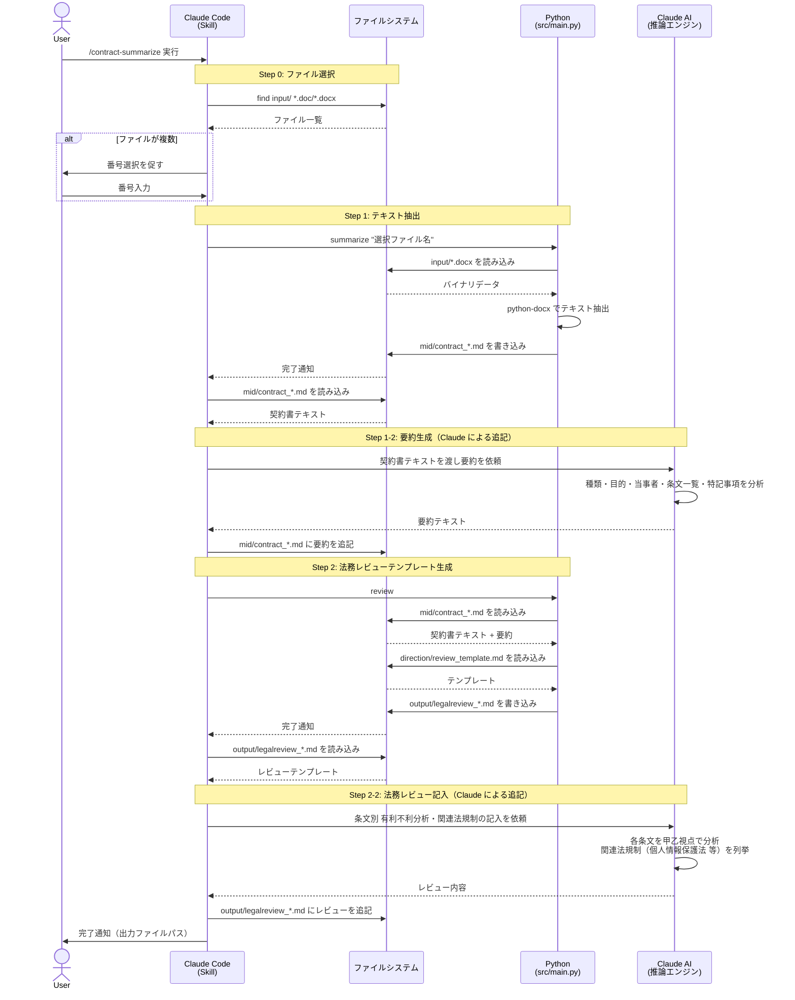
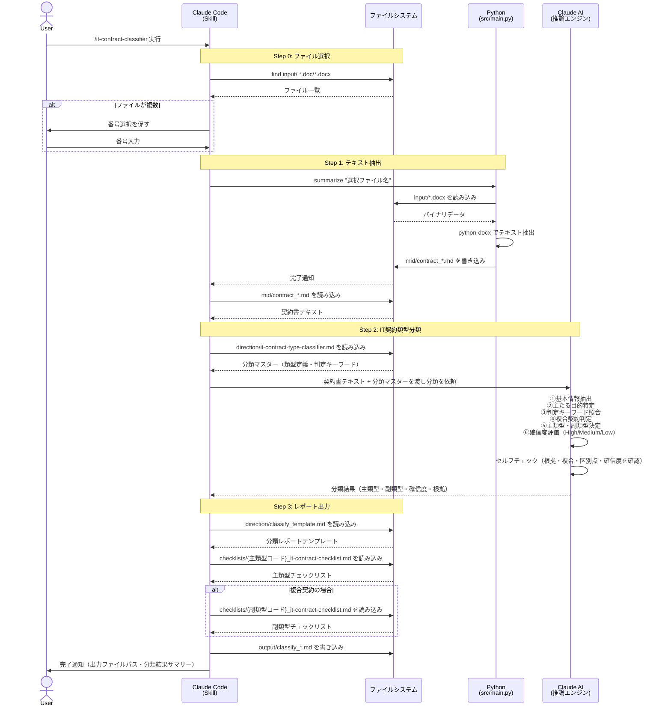
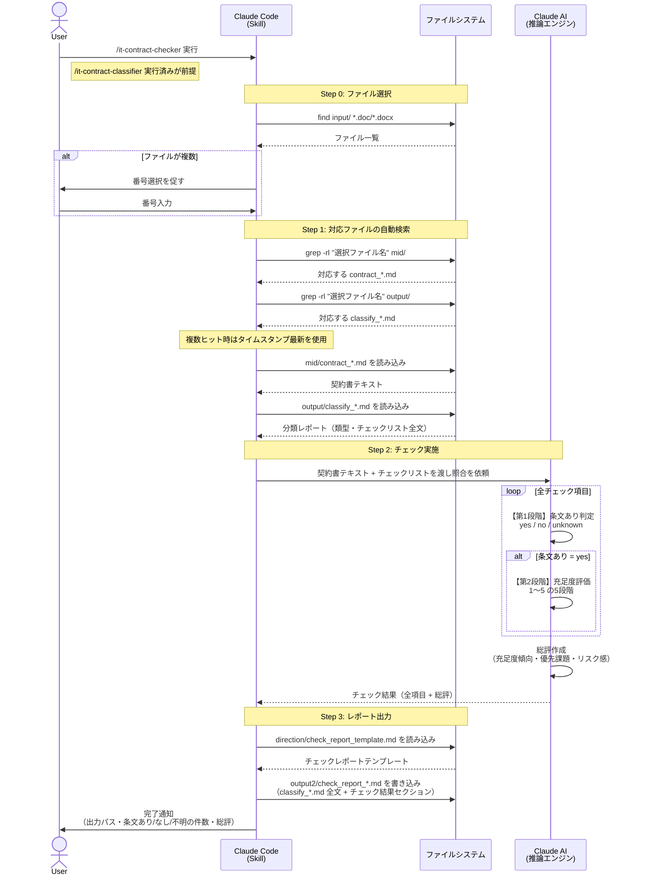

# Microsoft環境への移植検討

## 背景

Microsoft Copilot Pro ライセンスを持つ企業環境への移植を検討する際の選択肢と比較。  
契約書の機密性・処理ロジックの複雑さを考慮し、以下の3つの選択肢を検討する。

<br>

## 現行アーキテクチャと移植先の比較

| レイヤー | 現状 | A: Azure OpenAI | B: Copilot Studio | C: M365 Copilot |
|:---:|:---:|:---:|:---:|:---:|
| AI基盤 | Anthropic Claude<br>（Claude Code / API） | Azure OpenAI Service<br>（GPT-4o） | Copilot Studio（GPT-4o）<br>+ AI Builder | Microsoft 365 Copilot<br>（Word / Teams） |
| 文書処理 | Python<br>（python-docx / antiword） | Python<br>（python-docx / antiword）<br>※変更なし | AI Builder ドキュメント処理<br>+ SharePoint コネクタ | Word が自動処理<br>（docx ネイティブ対応） |
| ロジック | `.claude/commands/` の Skill<br>（Markdown定義） | Python スクリプト<br>（プロンプトをコードに内包） | Copilot Studio トピック／アクション<br>（ローコード定義） | 人手によるプロンプト入力<br>（自動化なし） |
| UI | CLI<br>（ターミナル操作） | CLI<br>（ターミナル操作）<br>※変更なし | Teams チャット<br>/ SharePoint ポータル | Word / Teams の<br>Copilot チャット欄 |
| 出力 | Markdownファイル<br>（output/, output2/） | Markdownファイル<br>（output/, output2/）<br>※変更なし | SharePoint ドキュメント<br>/ Teams メッセージ | Word ドキュメント<br>/ Teams チャット返答 |

---

<br>

## 各選択肢の詳細

### 選択肢 A: Azure OpenAI Service へのバックエンド差し替え（推奨）

**概要**: 現行の Python コードと分類ロジックをほぼそのまま活かし、AI 呼び出し先を Claude → Azure OpenAI (GPT-4o) に切り替える。

```
[.docx 入力] → [Python: python-docx で抽出] → [Azure OpenAI API で分類/チェック] → [Markdown 出力]
```

**工数感**: 中（1〜2週間）

---

### 選択肢 B: Copilot Studio でカスタム Copilot を構築

**概要**: Microsoft の Copilot Studio（ローコード）でエージェントを作り、SharePoint 上の契約書を処理させる。

```
[SharePoint: .docx 保存] → [Copilot Studio エージェント] → [AI Builder + GPT-4] → [SharePoint/Teams に出力]
```

**工数感**: 大（1〜2ヶ月、かつスキルセットが M365 管理者寄りになる）

---

### 選択肢 C: M365 Copilot（Word / Teams）を補助ツールとして活用（最小移植）

**概要**: 契約書を SharePoint に置き、Word Copilot や Teams Copilot を使って手動レビューを補助する。自動化はしない。

**工数感**: 小（ほぼゼロ）、ただし機能的な価値も小

---

<br>

## Pros / Cons 比較

| 観点 | A: Azure OpenAI | B: Copilot Studio | C: M365 Copilot |
|:---:|:---|:---|:---|
| **Pros** | ・現行ロジック（チェックリスト・分類マスター）をそのまま流用できる<br>・Azure テナント内でデータが完結し、情報漏洩リスクが低い<br>・Azure OpenAI の従量課金は安価（GPT-4o）<br>・段階的な移行が可能（AI 呼び出しだけ先行差し替え） | ・M365 Copilot ライセンスがあれば追加コストが比較的少ない<br>・Teams・Word との統合が容易（社内で使い慣れた UI）<br>・ガバナンス・監査ログが M365 管理センターで一元管理できる | ・追加開発ゼロ<br>・Copilot Pro / M365 Copilot ライセンスをそのまま活用できる<br>・導入障壁が最も低い |
| **Cons** | ・Claude と GPT-4o でプロンプトの挙動が異なるため調整が必要<br>・Skill 機構（Markdown定義）が使えなくなり Python コードへの書き直しが必要<br>・Azure リソースのプロビジョニング作業が発生<br>・Copilot Pro ライセンスに Azure OpenAI は含まれない（別途コスト） | ・チェックリスト照合や複雑な分類ロジックの実装がローコードでは困難<br>・AI Builder のドキュメント処理能力は Claude より劣る<br>・分類マスター等を「知識ソース」として取り込む工夫が必要<br>・Markdown 出力フォーマットを SharePoint 向けに再設計が必要 | ・自動分類・チェックレポート生成の価値がほぼ失われる<br>・1件ごとに人手でプロンプトを入力する必要がある<br>・出力フォーマットが毎回異なり品質が安定しない<br>・チェックリスト照合の自動化が不可能 |

---

<br>

## 総合評価

| 観点 | A: Azure OpenAI | B: Copilot Studio | C: M365 Copilot |
|:---:|:---:|:---:|:---:|
| 現行機能の維持 | 高 | 中 | 低 |
| 開発コスト | 中（1〜2週間） | 大（1〜2ヶ月） | 小（ほぼゼロ） |
| ライセンス活用 | 低〜中 | 高 | 高 |
| データセキュリティ | 高 | 高 | 高 |
| 運用・保守容易性 | 中 | 高 | 高 |

---

<br>

## 推奨

**選択肢 A（Azure OpenAI）が最も現実的。**

このプロジェクトの核心価値は「分類マスター・チェックリストとの照合ロジック」にあり、Copilot Studio のローコードでは忠実な再現が難しい。

Copilot Pro ライセンスの活用を最大化するなら、**A + C の組み合わせ**（バックエンドは Azure OpenAI で自動処理、結果確認・共有は Teams/SharePoint）が現実的な落としどころ。

---

<br>
<br>

# Appendix

## A 現行アーキテクチャ シーケンス図

### A-1. `/contract-summarize`（法務レビュー生成）



---

### A-2. `/it-contract-classifier`（IT契約類型分類）



---

### A-3. `/it-contract-checker`（チェックリスト照合）



---

<br>
<br>

## B 移植方法に関するAIによる所見

### B-1. Gemini （3.1 Pro）

```
## 1. 推奨案（選択肢A）の妥当性について

資料の結論である「選択肢A（Azure OpenAI）の推奨」は、技術的にもビジネス的にも最も理にかなったアプローチです。

* **複雑なロジックの維持:** シーケンス図（Appendix A）を拝見すると、現行システムは「分類マスターの読み込み」「複合契約の判定」「2段階の充足度評価」など、プログラム（Python）とプロンプトによる高度で多段的な制御を行っています。これをCopilot Studioなどのローコードツールで忠実に再現するのは、技術的な制約が多く非現実的です。
* **投資の保護とコスト管理:** 既存のロジック資産（Pythonコードやチェックリスト）を活かしつつ、バックエンドのAIモデルのみを差し替えるアプローチは、移行リスクと開発コストを最小限に抑える堅実な戦略です。Azure OpenAIの従量課金モデルは、ランニングコストの予測と最適化にも適しています。
* **ハイブリッドなUX展開:** バックエンドの自動処理はAzure OpenAIに任せ、結果の共有や確認プロセスにTeamsやSharePoint（M365 Copilot）を活用する「A + C」の組み合わせ案は、ユーザーエクスペリエンスと自動化の恩恵を両立させる素晴らしい落としどころです。

---

## 2. 移行にあたっての技術的な留意点

選択肢Aを進める上で、いくつか事前に考慮しておくべき技術的なポイントがあります。

* **プロンプトの互換性とチューニング:** ClaudeとGPT-4oでは、指示の解釈やフォーマットの出力精度に違いがあります。特にClaudeはXMLタグを用いた構造化プロンプトの処理に長けていますが、GPT-4oにはシステムプロンプトによる役割定義とFew-shot（例示）アプローチが有効なケースが多いです。プロンプトの再調整工数はやや多めに見積もることをお勧めします。
* **Skill機構のPython化:** 現在 `.claude/commands/` のMarkdownで定義されているSkillをPythonに移植する際、マルチステップの処理（Step 1の出力をStep 2の入力にする等）における状態管理やエラーハンドリングの実装が必要になります。
* **コンテキストウィンドウの管理:** 長大な契約書とチェックリストを同時に読み込ませる場合、GPT-4oのトークン上限や、コンテキストの途中で指示を忘れてしまう「Lost in the middle」現象への対策（情報のチャンク化など）が必要になる可能性があります。

---

## 3. セキュリティとコンプライアンス

法務レビューや契約書という機密性の高いドキュメントを処理するシステムにおいて、データのガバナンスは最重要課題です。

* Azureテナント内でデータ処理を完結させ、M365のセキュアな境界内で完結させるアーキテクチャは、情報漏洩リスクを極小化できるため、社内のセキュリティ審査を通過しやすい強力な利点となります。

```

<br>

### B-2. Claude（Opus4.7）

```
このドキュメント、論点はよく整理されていますし、結論（A推奨、A+Cの落としどころ）も方向性として妥当だと思います。その上で、いくつか所見を述べます。

## 1. Skill機構の喪失を過小評価している

「Skill機構が使えなくなりPythonコードへの書き直しが必要」と Cons に書かれていますが、これは単なる移行コストではなく**アーキテクチャ上の特性が失われる**話です。`.claude/commands/` の Markdown はプロンプトとロジックの分離を実現していて、非エンジニアでも編集・レビューできる点に価値があります。コードに埋め込むと、プロンプト調整のたびにデプロイが必要になり、反復速度が落ちます。

**緩和策**: 選択肢 A でも、Markdown ファイルをシステムプロンプトとしてランタイム読み込みする設計にすれば、この特性は保てます。`direction/` や `checklists/` 配下のファイルを構成として外出ししておけば、移植先でもファイル差し替えだけで挙動を変えられます。これは設計時に明示的に意識すべき論点です。

## 2. モデル差異の影響範囲が抽象的

「プロンプトの挙動が異なるため調整が必要」では弱いです。具体的に懸念があるのは：

- `/it-contract-classifier` の **5段階推論 + 確信度評価（High/Medium/Low）+ セルフチェック** の再現性。GPT-4o でこの構造が同等に機能するかは検証必須。
- `/it-contract-checker` の **2段階判定（条文あり判定 → 5段階充足度）** の一貫性。長い契約書 × 多数のチェック項目では出力ブレが出やすい。
- 長文契約書（50ページ超）のコンテキスト処理。トークン上限とチャンク戦略が必要になる可能性。

PoC では「同一契約書を Claude / GPT-4o の両方で処理し、分類結果と充足度評価の一致率を測る」ステップを入れるべきです。

## 3. AIエージェントガバナンス枠組みとの整合性が触れられていない

過去に整備された「AIをコリーグとして扱う」「Human in the Loop」「自動送信禁止」「監査ログ」といった原則と、各選択肢の整合性を評価軸に加える価値があります。

- **A**: CLI ベースで人間が起動・確認するため、原則と整合的
- **B**: Teams 統合で「自動応答」的な使われ方になりやすく、特に「自動送信禁止」原則と緊張関係が生じうる
- **C**: 完全に人手なので原則上は問題ないが、監査ログの粒度（どのプロンプトでどの結果が出たか）が弱い

この観点は経営層・コンプラ部門への説明材料としても効きます。

## 4. コスト推計が定性的すぎる

「従量課金は安価」だけでは予算申請の根拠になりません。ざっくりでも：契約書1件 ≈ 30K入力トークン × 複数パス、出力 5–10K トークン → GPT-4o で 1件あたり数十円〜100円台、月100件処理しても数千〜1万円台、という試算を入れておくと意思決定が早いです。

## 5. 工数感「1〜2週間」は楽観的では

Azureテナント側のプロビジョニング承認（特に製薬系の場合、情シス・セキュリティ審査）、プロンプト再調整、多様な契約書での検証を含めると、**PoC 1〜2週間 / 本番運用化まで 4〜6週間**が現実的だと思います。「1〜2週間」とだけ書くと後でスコープ崩壊しがちです。

## 6. 「Copilot Pro活用最大化」の前提を再検討

A は実質的に Copilot Pro ライセンスを使いません。本当の目的が「Microsoft環境への準拠」であれば A で十分ですが、「ライセンス活用」を目的とするなら A は答えにならない。**ドキュメント冒頭の動機を「ライセンス活用」から「企業ガバナンス下での運用」に書き換えた方が、結論との整合性が取れる**と思います。

---

総じて、推奨は変えなくていいですが、(1) Skill機構を保存する設計指針、(2) モデル差異の検証計画、(3) ガバナンス整合性の明記、(4) コスト試算、を追記すると、稟議・上申資料として強くなります。

```

<br>

### B-3. ChatGPT（無課金）

```
全体として、かなり整理度の高い比較メモです。

特に優れているのは、「AI製品比較」ではなく、現行システムの本質的価値（分類ロジック・チェックリスト照合）を中心に評価軸を置けている点です。単なる“Copilotへ乗り換えられるか”ではなく、「現在の業務価値をどこまで維持できるか」で見ているので、実務的です。

そのうえで、所見をいくつか述べます。

---

# 1. 結論（A推奨）は妥当

> 「A + C の組み合わせ」が現実的

これはかなり現実路線だと思います。

特にこのシステムは、単なる要約AIではなく、

- 類型判定
- チェックリスト照合
- 複合契約判定
- 根拠提示
- セルフチェック

という「推論ワークフロー」が本体です。

つまり価値の中心は UI ではなく、  
`.claude/commands/` に埋め込まれた業務知識です。

そのため、Copilot Studio のようなローコード製品へ全面移植すると、

- ロジック表現力不足
- プロンプト管理困難
- テスト困難
- バージョン管理困難

が発生しやすいです。

この点をきちんと見抜けているのが良いです。

---

# 2. 実は「Skill機構」が最大の資産

メモではやや軽く書かれていますが、実際にはここが重要です。

現行構成は、

- Python = 前処理・ファイル処理
- Claude = 推論
- Skill Markdown = 業務知識とオーケストレーション

に分離されています。

つまり `.claude/commands/` は実質的に、

> 「法務レビュー用 DSL（ドメイン特化言語）」

として機能しています。

これはかなり価値があります。

逆に Azure OpenAI 化すると、この DSL 的資産をどう保持するかが課題になります。

現状メモでは、

> 「Python コードへの書き直し」

とありますが、完全埋め込みにすると将来的に保守性が落ちる可能性があります。

むしろおすすめは：

- Markdown ベースの Skill 定義を残す
- Python は実行エンジンだけにする
- LLM backend を抽象化する

です。

```

<br>
<br>

## C PoC計画

### 目的

選択肢A（Azure OpenAI Service へのバックエンド差し替え）の技術的実現可能性を、本番運用化の判断に必要な精度で検証する。具体的には、現行 Claude ベースの推論ワークフローを GPT-4o へ移植した際の **分類精度・充足度評価精度・出力フォーマット安定性** が業務要件を満たすかを定量評価する。

<br>

### スコープ

検証対象は現行 3 コマンドのうち、業務価値の中核である以下の 2 つ。`/contract-summarize` は出力品質の機械評価が難しく PoC ではサンプリング目視確認に留める。

| コマンド | PoC での扱い | 理由 |
|:---|:---|:---|
| `/contract-summarize` | 補助検証（目視） | 要約品質は定量化困難、影響範囲も限定的 |
| `/it-contract-classifier` | **主検証対象** | 分類マスター照合は本システムの中核ロジック |
| `/it-contract-checker` | **主検証対象** | 2段階判定の安定性が運用品質を左右する |

<br>

### 検証KPI

現行 Claude の出力を**正解ラベル（参照）**として扱い、GPT-4o の出力との一致率を測る。事前に法務担当のレビュー済みサンプル数件を用意できれば、それを真の正解として併用する。

| 指標 | 測定対象 | 目標値 | 補足 |
|:---|:---|:---:|:---|
| 主類型 一致率 | `/it-contract-classifier` | **90% 以上** | 完全一致で評価 |
| 副類型 一致率 | `/it-contract-classifier`（複合契約） | 80% 以上 | 複合判定の有無も含む |
| 確信度 一致率 | High/Medium/Low | 85% 以上 | 隣接ランクは許容しない |
| 条文あり判定 一致率 | `/it-contract-checker` 第1段階 | **90% 以上** | yes/no/unknown の3値 |
| 充足度評価 一致率（±1許容） | `/it-contract-checker` 第2段階 | 85% 以上 | 1〜5 の評価で ±1 を許容 |
| 出力フォーマット適合率 | テンプレート構造の保持 | **95% 以上** | パース可能であること |
| 平均レスポンスタイム | 1契約書あたり処理時間 | 現行比 ±50% | 大幅劣化していないこと |

<br>

### 実施フェーズ（2週間想定）

```
Week 1: 環境構築 + プロンプト移植
Week 2: 並行実行 + 評価 + 報告書作成
```

| フェーズ | 内容 | 期間 | 主担当 |
|:---|:---|:---:|:---|
| Phase 1 | Azure テナント / Azure OpenAI リソースのプロビジョニング、ネットワーク・認証設定 | 2〜3日 | 情シス・セキュリティ |
| Phase 2 | Skill Markdown → GPT-4o 向けプロンプトへの移植（XML構造 → システムプロンプト + Few-shot 形式への調整）、Python ランタイムの LLM backend 抽象化 | 3〜4日 | 開発担当 |
| Phase 3 | 評価サンプル契約書での並行実行（Claude / GPT-4o）、ログ取得 | 2日 | 開発担当 |
| Phase 4 | 一致率算出、サンプル目視レビュー、チューニング、報告書作成 | 3日 | 開発担当 + 法務 |

<br>

### 評価サンプル設計

| 区分 | 件数 | 選定基準 |
|:---|:---:|:---|
| 単純類型（典型的な業務委託・SaaS等） | 6 件 | 主要類型を網羅 |
| 複合契約 | 3 件 | 副類型判定の検証 |
| 長文（30ページ超） | 2 件 | コンテキスト処理・Lost in the middle 対策の検証 |
| エッジケース（曖昧な類型） | 2 件 | 確信度 Low 周辺の挙動確認 |
| **合計** | **13 件** | 既存の処理済み契約書から選定 |

<br>

### 成功基準（Go/No-Go判定）

PoC 完了時に以下の **すべて** を満たした場合、本番運用化フェーズへ移行する。

- 主類型 一致率 90% 以上
- 条文あり判定 一致率 90% 以上
- 出力フォーマット適合率 95% 以上
- 法務担当による目視レビューで「実用上問題なし」と判断される

いずれかを下回った場合は、原因分析の上で **(a) プロンプトチューニング継続**、**(b) Skill 機構保持設計の再検討**、**(c) 選択肢 B/C への戦略変更** のいずれかを判断する。

<br>

### 体制・関係部門

| 役割 | 担当 | 主な責務 |
|:---|:---|:---|
| プロジェクトオーナー | 情シス管理職 | Go/No-Go 判断、稟議 |
| 開発担当 | 情シス | プロンプト移植、評価実装 |
| 法務担当 | 法務部門 | 目視レビュー、業務適合性判断 |
| インフラ承認 | 情シス・セキュリティ | Azure テナント・OpenAI リソース承認 |
| ガバナンス確認 | コンプラ・QA | AIエージェントガバナンス原則との整合性確認 |

<br>

### リスク・前提

| 項目 | リスク | 緩和策 |
|:---|:---|:---|
| Azure リソース承認の遅延 | プロビジョニングが Week 1 内に完了しない | PoC 開始前にセキュリティ部門と事前協議、リソース申請を先行 |
| プロンプト互換性 | GPT-4o で Claude 同等の構造化推論が再現できない | Few-shot 例示の追加、Phase 4 でのチューニング枠を確保 |
| コンテキスト長 | 長文契約書 + チェックリストでトークン上限超過 | チャンク化戦略を Phase 2 で設計、長文サンプルで早期検証 |
| 評価の主観性 | 一致率の定義に解釈の余地 | 評価基準を Phase 1 で文書化、法務担当と合意 |

<br>

### 想定コスト

| 項目 | 概算 |
|:---|---:|
| Azure OpenAI 利用料（PoC 期間中） | 約 5,000 円以下（13件 × 数パス） |
| Azure リソース基本料 | 月数千円程度 |
| 工数（情シス） | 約 8〜10人日 |
| 工数（法務レビュー） | 約 1〜2人日 |

<br>

### 本番運用化フェーズ（PoC 後・参考）

PoC 成功後、本番運用化までの追加工数は **約 4〜6週間** を想定。

- 残コマンド（`/contract-summarize`）の移植
- エラーハンドリング・ロギング強化
- 監査ログ要件の実装（AIエージェントガバナンス原則準拠）
- 運用手順書・利用ガイド整備
- ユーザー受け入れテスト（UAT）