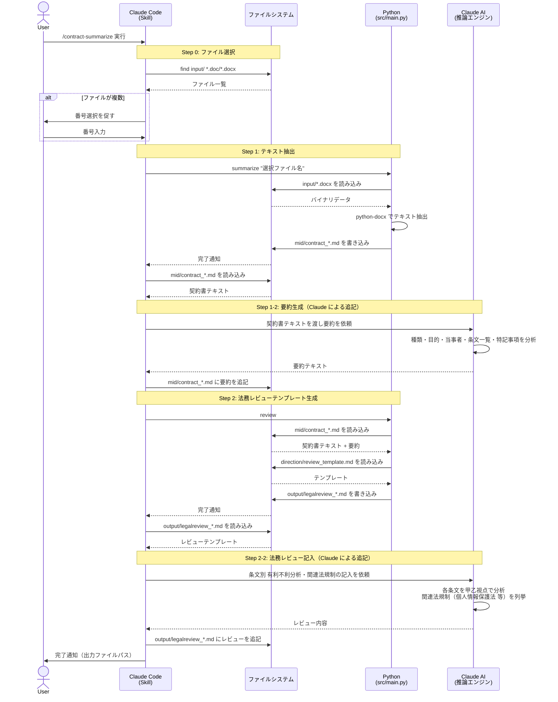
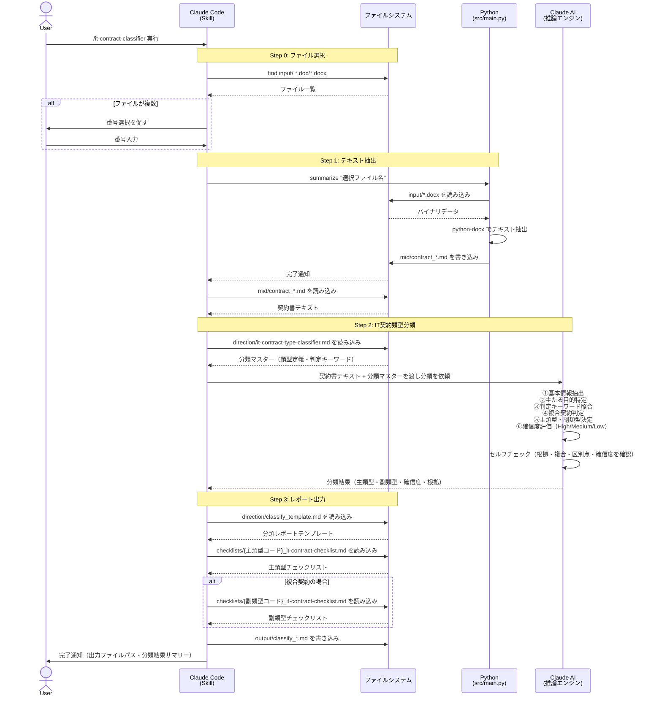
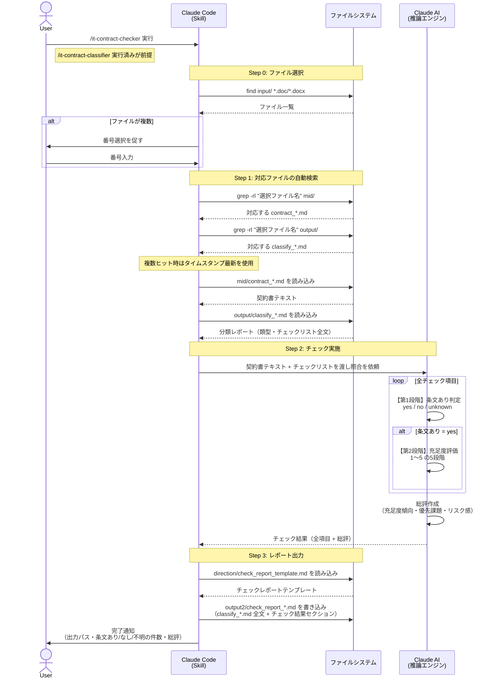

# Microsoft 企業環境への移植検討メモ

作成日: 2026-05-09

## 背景

Microsoft Copilot Pro ライセンスを持つ企業環境への移植を検討する際の選択肢と比較。  
契約書の機密性・処理ロジックの複雑さを考慮し、以下の3つの選択肢を検討する。

---

## 現行アーキテクチャと移植先の比較

| レイヤー | 現状 | A: Azure OpenAI | B: Copilot Studio | C: M365 Copilot |
|:---:|:---:|:---:|:---:|:---:|
| AI基盤 | Anthropic Claude<br>（Claude Code / API） | Azure OpenAI Service<br>（GPT-4o） | Copilot Studio（GPT-4o）<br>+ AI Builder | Microsoft 365 Copilot<br>（Word / Teams） |
| 文書処理 | Python<br>（python-docx / antiword） | Python<br>（python-docx / antiword）<br>※変更なし | AI Builder ドキュメント処理<br>+ SharePoint コネクタ | Word が自動処理<br>（docx ネイティブ対応） |
| ロジック | `.claude/commands/` の Skill<br>（Markdown定義） | Python スクリプト<br>（プロンプトをコードに内包） | Copilot Studio トピック／アクション<br>（ローコード定義） | 人手によるプロンプト入力<br>（自動化なし） |
| UI | CLI<br>（ターミナル操作） | CLI<br>（ターミナル操作）<br>※変更なし | Teams チャット<br>/ SharePoint ポータル | Word / Teams の<br>Copilot チャット欄 |
| 出力 | Markdownファイル<br>（output/, output2/） | Markdownファイル<br>（output/, output2/）<br>※変更なし | SharePoint ドキュメント<br>/ Teams メッセージ | Word ドキュメント<br>/ Teams チャット返答 |

---

## 各選択肢の詳細

### 選択肢 A: Azure OpenAI Service へのバックエンド差し替え（推奨）

**概要**: 現行の Python コードと分類ロジックをほぼそのまま活かし、AI 呼び出し先を Claude → Azure OpenAI (GPT-4o) に切り替える。

```
[.docx 入力] → [Python: python-docx で抽出] → [Azure OpenAI API で分類/チェック] → [Markdown 出力]
```

**工数感**: 中（1〜2週間）

---

### 選択肢 B: Copilot Studio でカスタム Copilot を構築

**概要**: Microsoft の Copilot Studio（ローコード）でエージェントを作り、SharePoint 上の契約書を処理させる。

```
[SharePoint: .docx 保存] → [Copilot Studio エージェント] → [AI Builder + GPT-4] → [SharePoint/Teams に出力]
```

**工数感**: 大（1〜2ヶ月、かつスキルセットが M365 管理者寄りになる）

---

### 選択肢 C: M365 Copilot（Word / Teams）を補助ツールとして活用（最小移植）

**概要**: 契約書を SharePoint に置き、Word Copilot や Teams Copilot を使って手動レビューを補助する。自動化はしない。

**工数感**: 小（ほぼゼロ）、ただし機能的な価値も小

---

## Pros / Cons 比較

| 観点 | A: Azure OpenAI | B: Copilot Studio | C: M365 Copilot |
|:---:|:---|:---|:---|
| **Pros** | ・現行ロジック（チェックリスト・分類マスター）をそのまま流用できる<br>・Azure テナント内でデータが完結し、情報漏洩リスクが低い<br>・Azure OpenAI の従量課金は安価（GPT-4o）<br>・段階的な移行が可能（AI 呼び出しだけ先行差し替え） | ・M365 Copilot ライセンスがあれば追加コストが比較的少ない<br>・Teams・Word との統合が容易（社内で使い慣れた UI）<br>・ガバナンス・監査ログが M365 管理センターで一元管理できる | ・追加開発ゼロ<br>・Copilot Pro / M365 Copilot ライセンスをそのまま活用できる<br>・導入障壁が最も低い |
| **Cons** | ・Claude と GPT-4o でプロンプトの挙動が異なるため調整が必要<br>・Skill 機構（Markdown定義）が使えなくなり Python コードへの書き直しが必要<br>・Azure リソースのプロビジョニング作業が発生<br>・Copilot Pro ライセンスに Azure OpenAI は含まれない（別途コスト） | ・チェックリスト照合や複雑な分類ロジックの実装がローコードでは困難<br>・AI Builder のドキュメント処理能力は Claude より劣る<br>・分類マスター等を「知識ソース」として取り込む工夫が必要<br>・Markdown 出力フォーマットを SharePoint 向けに再設計が必要 | ・自動分類・チェックレポート生成の価値がほぼ失われる<br>・1件ごとに人手でプロンプトを入力する必要がある<br>・出力フォーマットが毎回異なり品質が安定しない<br>・チェックリスト照合の自動化が不可能 |

---

## 総合評価

| 観点 | A: Azure OpenAI | B: Copilot Studio | C: M365 Copilot |
|:---:|:---:|:---:|:---:|
| 現行機能の維持 | 高 | 中 | 低 |
| 開発コスト | 中（1〜2週間） | 大（1〜2ヶ月） | 小（ほぼゼロ） |
| ライセンス活用 | 低〜中 | 高 | 高 |
| データセキュリティ | 高 | 高 | 高 |
| 運用・保守容易性 | 中 | 高 | 高 |

---

## 推奨

**選択肢 A（Azure OpenAI）が最も現実的。**

このプロジェクトの核心価値は「分類マスター・チェックリストとの照合ロジック」にあり、Copilot Studio のローコードでは忠実な再現が難しい。

Copilot Pro ライセンスの活用を最大化するなら、**A + C の組み合わせ**（バックエンドは Azure OpenAI で自動処理、結果確認・共有は Teams/SharePoint）が現実的な落としどころ。

---

## Appendix: 現行アーキテクチャ シーケンス図

### A-1. `/contract-summarize`（法務レビュー生成）



---

### A-2. `/it-contract-classifier`（IT契約類型分類）



---

### A-3. `/it-contract-checker`（チェックリスト照合）



---

